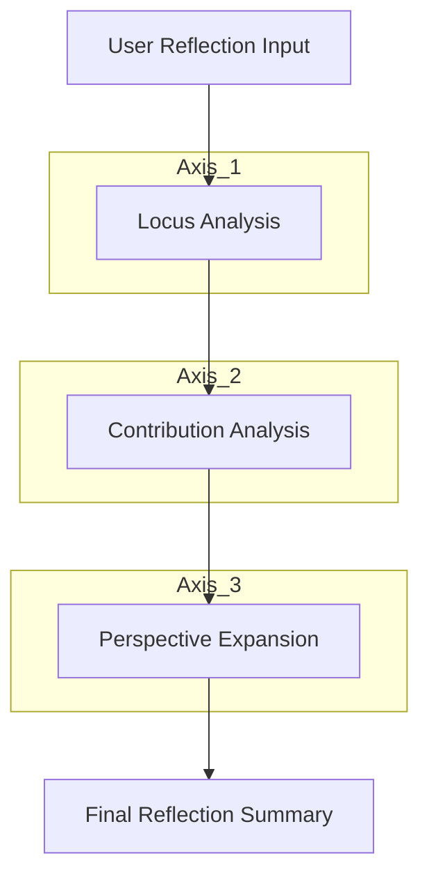

<h1 align="center">🧠 ReflectOS</h1>
<h3 align="center">⚡ A Deterministic Reflection Engine for Human Decision Intelligence</h3>

<p align="center">
  
  
  
  
</p>

<p align="center">
  <b>🔁 Structured Thinking • 🧭 Guided Reflection • 🎯 Predictable Outcomes</b>
</p>

---

## 🎥 Demo — Reflection System in Action  

<p align="center">
  
</p>

<p align="center">
  <b>⚡ A structured conversation that transforms how you think about your day</b>
</p>

---

## 🧠 What is ReflectOS?

> A **deterministic reflection system** that guides users through structured thinking —  
> without relying on LLMs at runtime.

Unlike chatbots, ReflectOS ensures:

- ✅ Consistency  
- ✅ Explainability  
- ✅ Zero hallucination  

```
User Experience → Decision Tree → Structured Reflection → Insight
```

---

## ⚙️ Core Concept  

This system encodes **psychology into a structured decision tree**, not prompts.

👉 Every path is:
- Predefined  
- Traceable  
- Repeatable  

---

## 🧠 Reflection Intelligence Tree  

Instead of dynamic AI responses, ReflectOS uses a **deterministic branching system**:

- Fixed questions  
- Fixed options  
- Predefined transitions  
- Structured reflections  

---

## 🧭 Three Axes of Intelligence  

### 1️⃣ Locus — Control Awareness  
> Victim ↔ Victor  

- Do events happen *to you* or *through your choices*?

---

### 2️⃣ Orientation — Value Contribution  
> Entitlement ↔ Contribution  

- Did you focus on what you got or what you gave?

---

### 3️⃣ Radius — Perspective Expansion  
> Self ↔ Others  

- Was your thinking self-centered or system-aware?

---

## ⚡ System Flow  



---

## 🤖 Agent Design Philosophy  

Even though AI tools are used during development, the runtime system is:

```
🚫 No LLM calls  
✅ Deterministic logic  
✅ Structured branching  
```

---

## 🧪 Example Reflection Output  

```
You described your day as "Frustrating"

→ Focus shifted toward external factors  
→ Recognition expectations increased  
→ Perspective remained self-centered  

💡 Insight:
You had more control than it felt.  
Shifting toward contribution can improve tomorrow’s outcome.
```

---

## 🛠️ Tech Stack  

```
🐍 Python
⚡ Streamlit UI
📊 Structured Tree Data
🧠 Deterministic Engine
```

---

## 📂 Project Structure  

```
📁 ReflectOS
│── tree/                 # Reflection tree data
│── agent/                # Deterministic engine
│── app.py                # Streamlit UI
│── requirements.txt
│── README.md
```

---

## 🚀 Run Locally  

```bash
pip install -r requirements.txt
streamlit run app.py
```

---

## 🎯 Key Features  

✔️ Deterministic decision tree  
✔️ Multi-axis psychological modeling  
✔️ No runtime AI dependency  
✔️ Fully explainable reasoning paths  

---

## 🔮 Future Scope  

🚀 Personalized reflection paths  
📊 Behavioral analytics dashboard  
🧠 Adaptive learning loops  
🌐 Full deployment  

---

## 💡 Philosophy  

> “Better thinking is not generated —  
> it is structured.”

---

<p align="center">
  🧠 ReflectOS — Engineering Better Thinking
</p>
