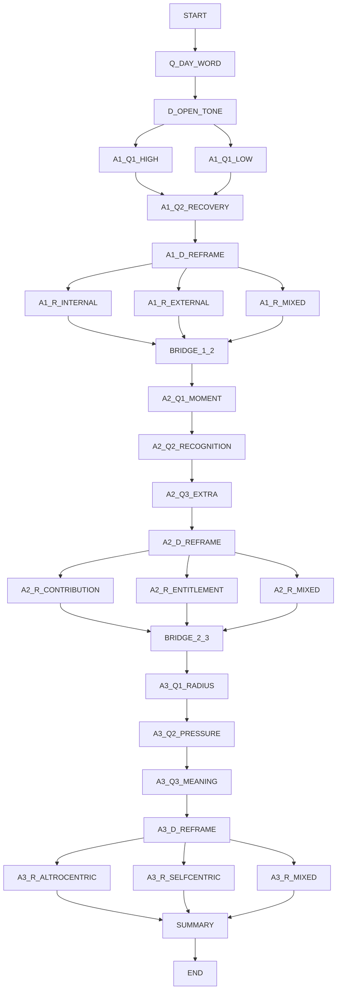

# Daily Reflection Tree Diagram

```mermaid
flowchart TD
    START --> Q_DAY_WORD
    Q_DAY_WORD --> D_OPEN_TONE
    D_OPEN_TONE --> A1_Q1_HIGH
    D_OPEN_TONE --> A1_Q1_LOW
    A1_Q1_HIGH --> A1_Q2_RECOVERY
    A1_Q1_LOW --> A1_Q2_RECOVERY
    A1_Q2_RECOVERY --> A1_D_REFRAME
    A1_D_REFRAME --> A1_R_INTERNAL
    A1_D_REFRAME --> A1_R_EXTERNAL
    A1_D_REFRAME --> A1_R_MIXED
    A1_R_INTERNAL --> BRIDGE_1_2
    A1_R_EXTERNAL --> BRIDGE_1_2
    A1_R_MIXED --> BRIDGE_1_2
    BRIDGE_1_2 --> A2_Q1_MOMENT
    A2_Q1_MOMENT --> A2_Q2_RECOGNITION
    A2_Q2_RECOGNITION --> A2_Q3_EXTRA
    A2_Q3_EXTRA --> A2_D_REFRAME
    A2_D_REFRAME --> A2_R_CONTRIBUTION
    A2_D_REFRAME --> A2_R_ENTITLEMENT
    A2_D_REFRAME --> A2_R_MIXED
    A2_R_CONTRIBUTION --> BRIDGE_2_3
    A2_R_ENTITLEMENT --> BRIDGE_2_3
    A2_R_MIXED --> BRIDGE_2_3
    BRIDGE_2_3 --> A3_Q1_RADIUS
    A3_Q1_RADIUS --> A3_Q2_PRESSURE
    A3_Q2_PRESSURE --> A3_Q3_MEANING
    A3_Q3_MEANING --> A3_D_REFRAME
    A3_D_REFRAME --> A3_R_ALTROCENTRIC
    A3_D_REFRAME --> A3_R_SELFCENTRIC
    A3_D_REFRAME --> A3_R_MIXED
    A3_R_ALTROCENTRIC --> SUMMARY
    A3_R_SELFCENTRIC --> SUMMARY
    A3_R_MIXED --> SUMMARY
    SUMMARY --> END
```
